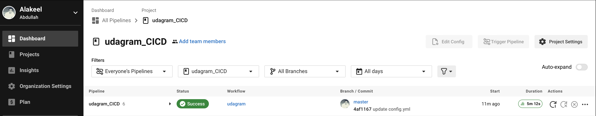
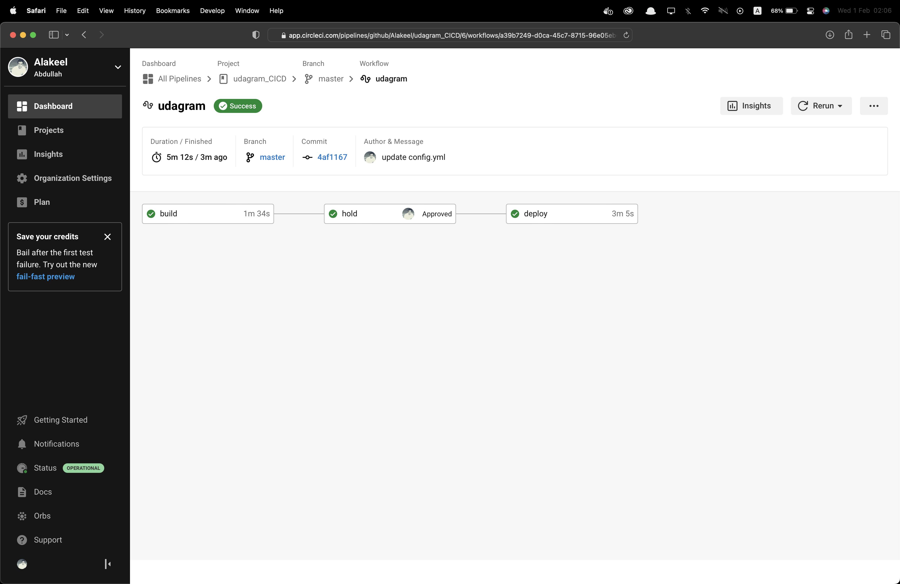
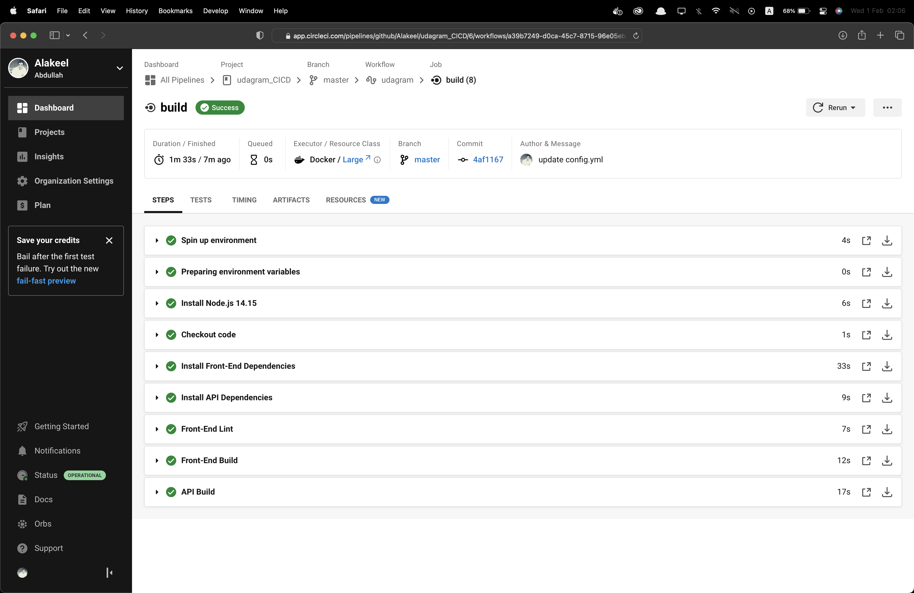
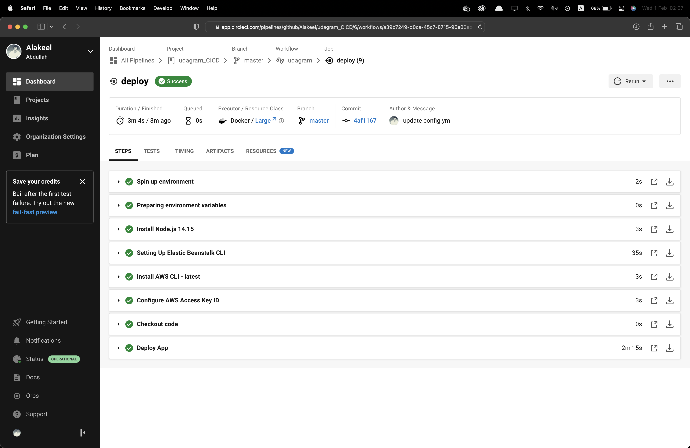

# Hosting a Full-Stack Application (Udagram)

## Overview
In this project I have demonstrated hosting full stack application in the Cloud by using CI/CD automation process  which I have built and deployed The Udagram Full-Stack application (backend & frontend & Postgres Database) to Amazon Web Service using CircleCi , AWS CLI , EB CLI and AWS cloud service including Elastic Beanstalk, RDS, S3, EC2.

**Link of Udagram-API Backend:**
> http://udagram-api-alakeel-dev.us-east-1.elasticbeanstalk.com/api/v0/feed

**Link for Udagram-Frontend Application:**
> http://udagram-alakeel.s3-website-us-east-1.amazonaws.com

## Documentation
1. [Application_dependencies](./documentation/Application_dependencies.md)
2. [Infrastructure_description](./documentation/Infrastructure_description.md)
3. [Pipeline_description](./documentation/Pipeline_description.md)
## Screenshots

### 1. Backend: Udagram-API:

### 2. Frontend: Udagram-Frontend:

### 3. AWS RDS for the database overview

### 4. AWS ElasticBeanstalk for the (backend) API deployment

### 5. AWS S3 for (frontend) web hosting

### 6. CircleCI - Latest successful Build & Deploy

#### 6.1 Build

#### 6.2 Deploy

### 7 Infrastructure Overview

---
@Author:
Abdullah Alakeel
