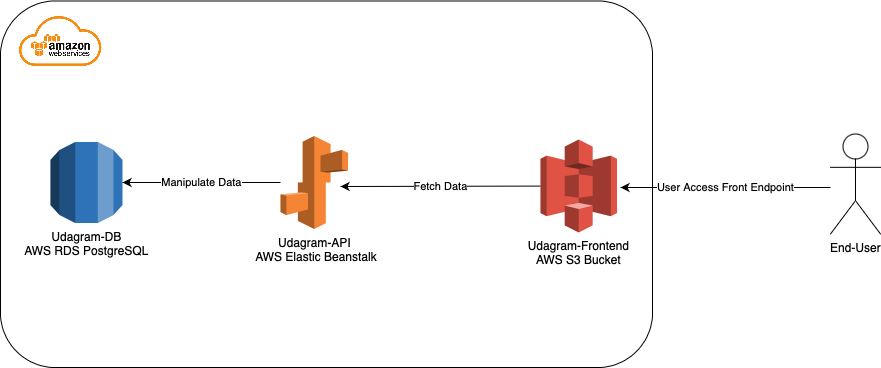
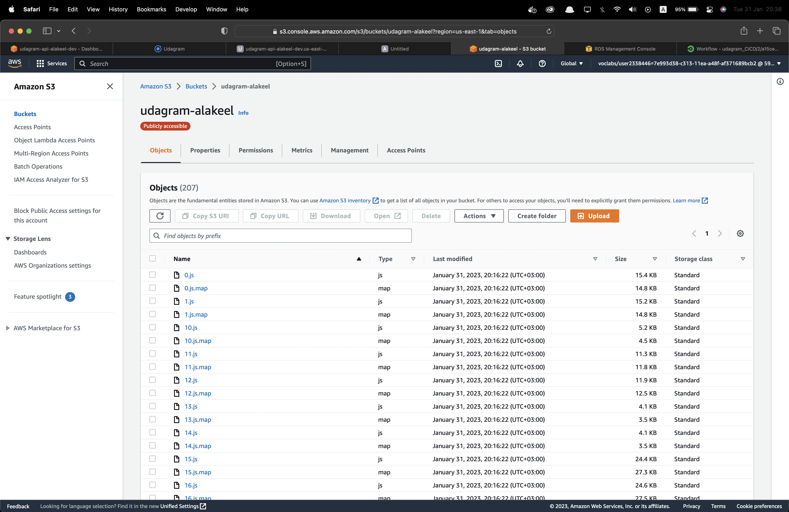
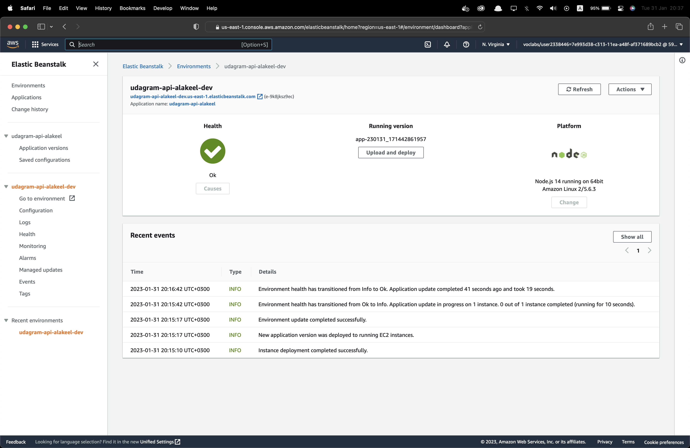

# Infrastructure_description

## Process Workflow

1. End-user accesses front-end via (S3) endpoint.
1. Front-end communicates with Backend API (AWS Elastic Beanstalk) & (EC2).
1. Backend API communicates with database (Postgres) in (AWS RDS) to update/delete data.

 

## Overview Architecture Diagram

## AWS Cloud Service
The following AWS services have been used to deploy and access the application from/to the cloud.

### S3
> Stores the static front-end application files, also it can be used to store any additional static resources for instance media.

### Elastic Beanstalk
> Using EB to deploy the backend application to the Cloud where EB handles the creation and setup a lot of services including EC2, autoscaling, and Elastic Load Balancer and more.

### RDS
> Setup and operate the Relational Database (Postgres).

 

## CircleCI Pipeline Overview

> Check **Pipeline_description.md** for more details.

---
@Author:
Abdullah Alakeel
